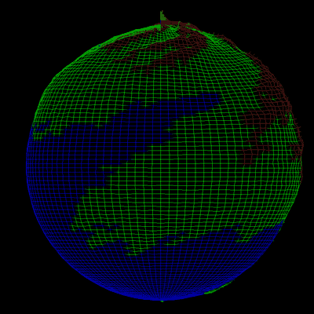
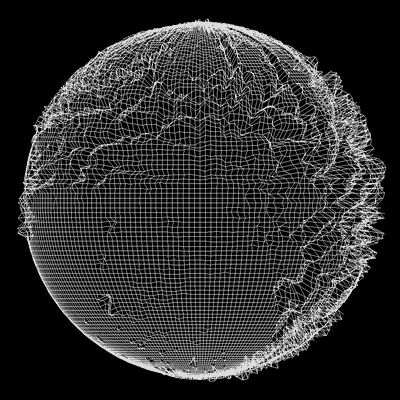
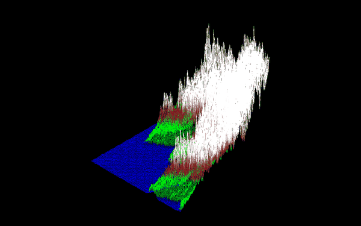
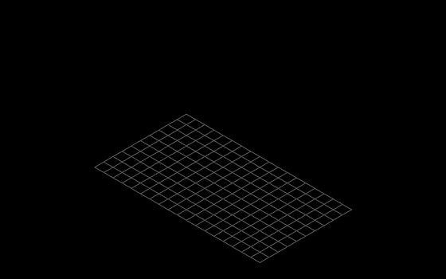

# FdF: 3D Wireframe Renderer

A real-time 3D wireframe renderer written in C from scratch. It turns a
heightmap file into an interactive 3D landscape that you can rotate, zoom and
wrap around a sphere. It was built for the [42 school](https://42.fr)
curriculum on top of the [MiniLibX](https://github.com/42Paris/minilibx-linux),
a minimal X11 graphics library. The library only gives you a window and a pixel
buffer, so the 3D math, line drawing and rendering loop are all hand-written.

<p align="center">
  
  
</p>

## Features

- **Two projections:** an isometric view of the map, or the same map wrapped
  around a sphere (press `TAB`).
- **Smooth real-time controls:** hold a key to rotate on 3 axes, pan, zoom
  or exaggerate the relief.
- **Per-vertex colors** read from the map file, with a color gradient drawn
  along every edge.
- **Auto-framing:** every map, from 7×7 to 500×500 points, opens centered
  and scaled to fit the window.
- **Hidden back face** in sphere mode, so the globe reads as a solid object.
- **Strict input validation:** clear error messages for missing files, empty
  maps, rows of different lengths and malformed values.
- **Clean shutdown** on `ESC` or with the window's close button. All
  allocations go through a small garbage collector.

## Demo

| Isometric terrain (200×200, colored) | Relief scaling |
|:---:|:---:|
|  |  |

## How it works

Every frame runs the same pipeline on each point of the grid:

```
 map file ──► parse ──► 3D point ──► rotate (Z, X, Y) ──► orthographic ──► Bresenham
                         │                                  projection       + color
                         ├─ flat:   (x, y, -altitude)                         gradient
                         └─ sphere: (longitude, latitude, radius + altitude)
```

**1. Parsing.** The file is read in one pass into a buffer that doubles
when it fills up, so reading takes linear time. Each value is validated, then
stored in an altitude grid and a color grid.

**2. Placing points in 3D.** In flat mode, a point `(x, y)` with altitude `z`
becomes `(x − w/2, y − h/2, −z)`, centered on the origin so rotations pivot
around the middle of the map. In sphere mode, the grid is wrapped onto a
globe:

```
longitude = x / width × 2π          latitude = y / (height − 1) × π
r = R + altitude × scale
X = r · sin(lat) · cos(lon)    Y = −r · cos(lat)    Z = r · sin(lat) · sin(lon)
```

The radius is `R = width / 2π`. With that radius the equator is as long as one
row of the map, so grid cells keep their proportions.

**3. Rotation.** The standard rotation matrices are applied around Z, then X,
then Y. The default isometric view is a rotation of 45° around Z, then a tilt
of `atan(√2)` around X.

**4. Projection and fitting.** An orthographic projection keeps X and Y and
uses Z as depth. Depth decides whether a point is on the hidden half of the
sphere. When a map loads, the program measures the projected bounding box and
picks the zoom and offset that make the map fill 80% of the window. Zooming
then scales the offset too, so the zoom stays centered on the screen.

**5. Drawing.** Edges are drawn with Bresenham's line algorithm, which uses
only integer arithmetic. The color of each pixel is interpolated between the
colors of the edge's two endpoints. Points are projected once per frame,
then reused for each of the up to four edges that touch them.

**Input loop.** Key-press and key-release events only set flags. A
`mlx_loop_hook` callback applies every held action once per frame and redraws.
This gives smooth, continuous motion that does not depend on the keyboard's
auto-repeat.

### Performance note

The first version took **11 s** to open the largest map (500×500 points,
2.9 MB). Profiling found two quadratic hot spots. The split function
recounted every word on each iteration, and the file reader copied the whole
buffer for every line it read. Fixing both brought loading down to **0.4 s**.

## Build & run

Requirements on Linux: `cc`, `make`, `libx11-dev`, `libxext-dev`.

```sh
git clone https://github.com/rmahrez19/FdF.git
cd FdF
make
./fdf maps/test_maps/t2.fdf
```

## Controls

| Key | Action |
|---|---|
| `↑` `↓` `←` `→` / `I` `K` | Rotate around the X / Y / Z axes (hold) |
| `W` `A` `S` `D` | Pan (hold) |
| `P` / `O` | Zoom in / out (hold) |
| `T` / `G` | Raise / flatten the relief (hold) |
| `TAB` | Switch between flat and sphere |
| `R` | Reset the view |
| `ESC` | Quit |

## Map format

Each number is the altitude of one grid point. A color can be added after a
comma, written in hexadecimal. Every row must have the same number of points.

```
0  0  0         0  0
0  10 10,0xFF0000 10 0
0  0  0         0  0
```

## Project structure

```
includes/fdf.h      types, constants and prototypes
src/main.c          entry point, window setup, event hooks
src/map_read.c      file reading
src/map_parse.c     grid allocation and parsing
src/map_utils.c     value validation, hex parsing
src/transform.c     flat / sphere placement, rotation, projection
src/view.c          default view and auto-fit
src/draw.c          per-frame rendering of the grid
src/line.c          Bresenham line with color gradient
src/hud.c           on-screen controls
src/events.c        keyboard and window events
src/actions.c       held-key actions applied each frame
src/exit.c          error handling and cleanup
libft/              my own C standard library (42 project)
mlx_linux/          MiniLibX (X11 graphics library)
```

## Author

**Rayen Mahrez**, student at 42 ([@rmahrez19](https://github.com/rmahrez19))
